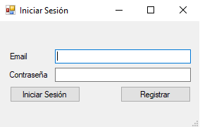
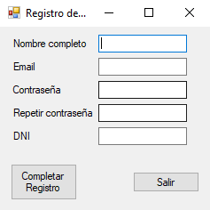
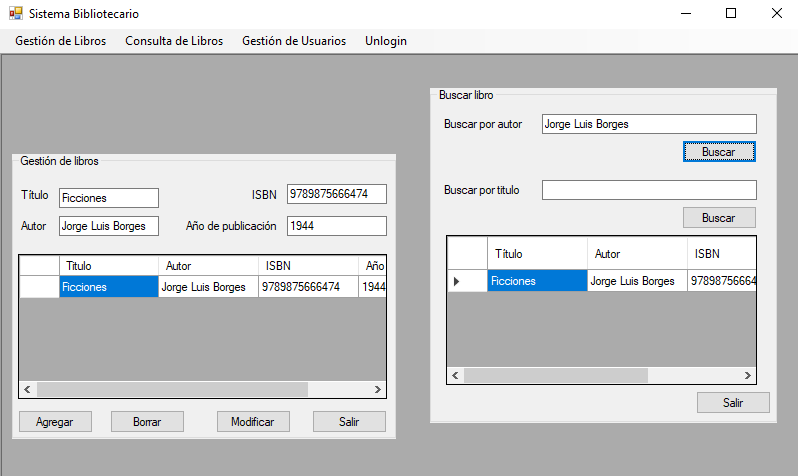

# Gestión de Biblioteca

## Descripción
Sistema de gestión bibliotecario desarrollado en C# con WinForms. Permite:
- Registro e inicio de sesión de usuarios.
- Sistema de acceso con permisos diferenciados (lector y administrador).
- Búsqueda de libros por nombre o autor.
- Gestión CRUD de libros y usuarios (solo para administradores).

## Tecnologías Utilizadas
- Lenguaje: C#
- IDE: Visual Studio
- Framework: WinForms (.NET Framework)
- Persistencia de datos: archivos CSV

## Instalación y uso
1. Cloná este repositorio:
	```bash
    git clone https://github.com/WladekDev/GestionBiblioteca.git
2. Abrí el proyecto con Visual Studio.
3. Ejecutá el archivo "Sistema Bibliotecario.sln"
4. Registrá un nuevo usuario lector o administrador.
5. Explorá las funcionalidades según el rol.

## Capturas de pantalla


*Formulario de inicio de sesión*



*Formulario de registro de usuarios*



*Pantalla principal del sistema con funcionalidades de búsqueda*

## Estado del proyecto
- Funcionalidad básica completa
- En desarrollo:
  - CRUD de usuarios
  - Validaciones y mejoras visuales

## Autor
Derek Iván "WladekDev" Metz 

[GitHub - Portfolio en desarrollo](https://github.com/WladekDev)